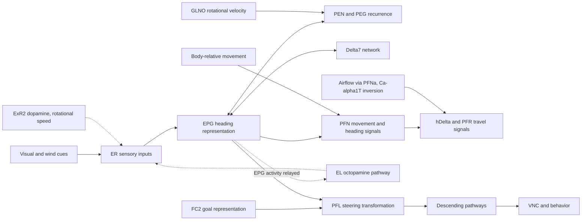

# What is understood, and what to investigate

## Is this the closest neuroscience has come to solving a cognitive circuit?

**It is a leading example, especially for an internal cognitive variable translated into action. “The most solved circuit in existence” is a stronger claim than the evidence supports.** There is no agreed ranking or definition of solved. Our assessment is that the strongest feature here is a unusually explicit connection between the computation, an algorithm, named cell types, and causal experiments. The [Maimon–Abbott 2026 review](https://doi.org/10.1146/annurev-neuro-112723-062711) is a particularly relevant synthesis.

The appropriate unit of understanding is a computation in specified conditions, not the whole fly or even the whole central complex. A wiring diagram restricts possible explanations; it does not determine synaptic efficacy, receptor effects, dynamics, learning rules, or behavior by itself. The [PFNa calcium-spike study](https://doi.org/10.1016/j.cell.2025.11.040) is an instructive recent example: intracellular signaling substantially changes how a population implements vector mathematics.

| Computation | Current assessment | Remaining task |
|---|---|---|
| Maintain and update heading | Strong functional, causal, anatomical, and theoretical account | Quantitatively predict robustness across contexts and individuals |
| Anchor heading to external cues | Strong evidence for experience-dependent sensory mapping; newer mechanistic work | Establish complete learning and forgetting rules across cue modalities |
| Transform body-relative movement into world-relative travel | Strong cell-level vector-computation account | Separate instantaneous velocity, displacement integration, and memory storage |
| Compare desired direction with heading and steer | Strong FC2/PFL framework in studied tasks | Explain goal acquisition, selection, switching, and routing to all relevant motor actions |
| Navigate natural odor landscapes | Rapid progress including 2026 directional-memory results | Integrate navigation strategies, variable wind, sensory loss, and free movement |
| Integrate travel vectors into position and store it | Behavioral odometry and re-zeroing exist; PFN→hΔB needed for distance memory; no identified integrator | Locate the accumulator (hΔB? PFR? FC?), its reset, and controls for self-deposited chemical marks |
| Provide rotational velocity to the compass | GLNO pair identified as the lateralised PEN input (preprint) | Confirm in print; find motor-signal sources |
| Explain the entire central complex | Incomplete | Internal state, sleep, action selection, and many cell types remain outside the compact navigation story |

Evidence and qualifications for each row are linked in the [reading map](literature.md). The table is our synthesis, not a consensus scorecard.

## Working circuit map

The diagram organizes hypotheses and established computations; it is not a literal directed subgraph or a claim of exclusively feed-forward wiring.

Read EPG→PFL as a functional heading-information route, not necessarily a direct connection. Recurrent and intermediary paths matter. In particular, preserve Delta7 and FB pathways when constructing the actual graph.

## Concrete next analyses

1. **Reconstruct compass recurrence at cell resolution.** Done for MaleCNS on 2026-09-10; see [compass-recurrence.md](compass-recurrence.md). Start with EPG, PEN_a(PEN1), PEN_b(PEN2), PEG, and Delta7. Recover angular organization from spatial/arbor and bridge-column annotations, then test shifted recurrent connectivity. A type-level matrix cannot demonstrate the angular shift.
2. **Resolve goal-cell correspondence.** Structural pass done 2026-09-10; see [goal-and-plasticity-motifs.md](goal-and-plasticity-motifs.md). Driver/morphology validation still open. The release splits FC2 into FC2A/B/C. Cross-check the paper's driver expression and morphology before assigning all subtypes the same goal function. Keep hemibrain and FlyWire type annotations alongside MaleCNS IDs.
3. **Trace PFL outputs to identified descending cells and onward through VNC.** Use our ranked one-hop table to choose targets, then add intermediates and normalize by each target's total input. Large raw counts are not automatically selective or functionally powerful.
4. **Test the sensory-plasticity motif structurally.** Done 2026-09-10 at ring-class resolution; see [goal-and-plasticity-motifs.md](goal-and-plasticity-motifs.md). Query EPG→EL, EL→ER, and ER→EPG at subtype and location resolution. Anatomy alone cannot establish octopamine release, receptor localization, or the learning rule.
5. **Compare matched circuits across specimens.** MaleCNS versus hemibrain/FlyWire can test recurrence, subtype counts, and asymmetry. Specimen and sex are confounded in a one-male/one-female comparison; a difference does not by itself establish sexual dimorphism.
6. **Build a constrained dynamical model only after the mapping audit.** Fit against published tuning, perturbation, drift, and steering data. Hold out perturbations for validation. A plausible bump generated by arbitrary weights is not a mechanistic validation of this connectome.

## Data interpretation rules

Body IDs belong to a specific release and specimen. Graph segments are not interchangeable with curated neurons. Preserve the release's confidence filter; do not add an undocumented edge threshold. Separate transmitter predictions from experimentally established transmitter/receptor effects. Use absent edges cautiously where proofreading, matching, or compartment coverage differs. The downloaded type-level graph does not contain the synapse coordinates needed for all of the spatial tests above.
